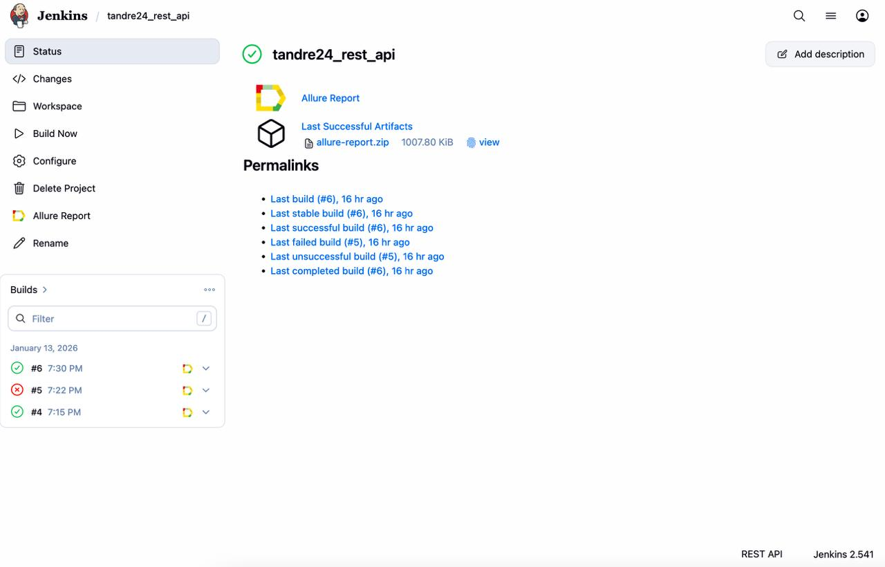
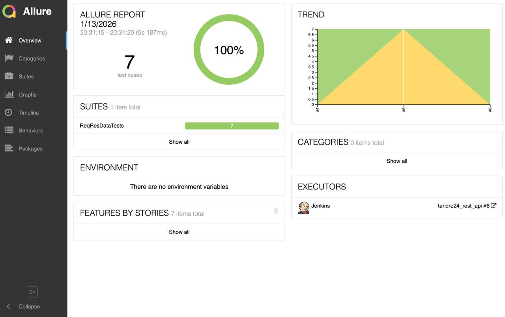
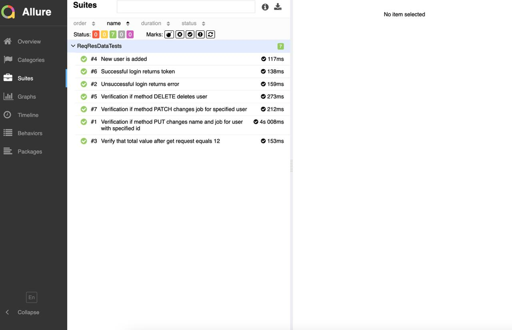
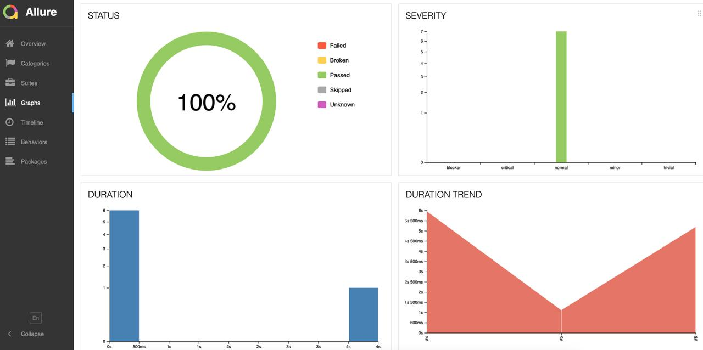
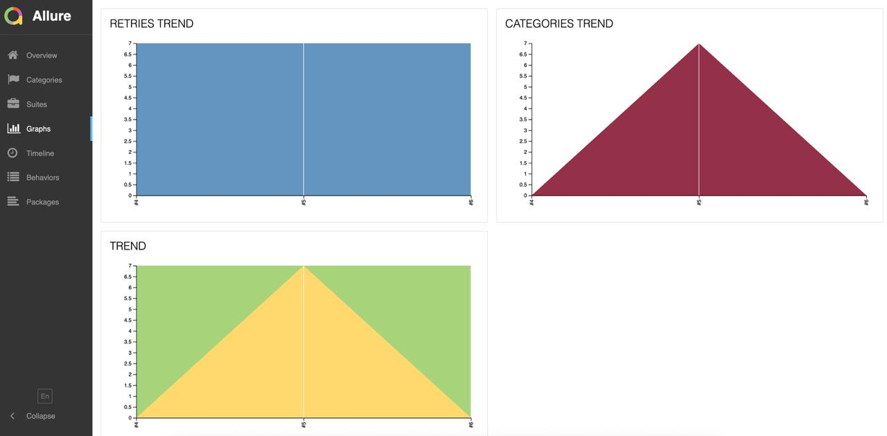
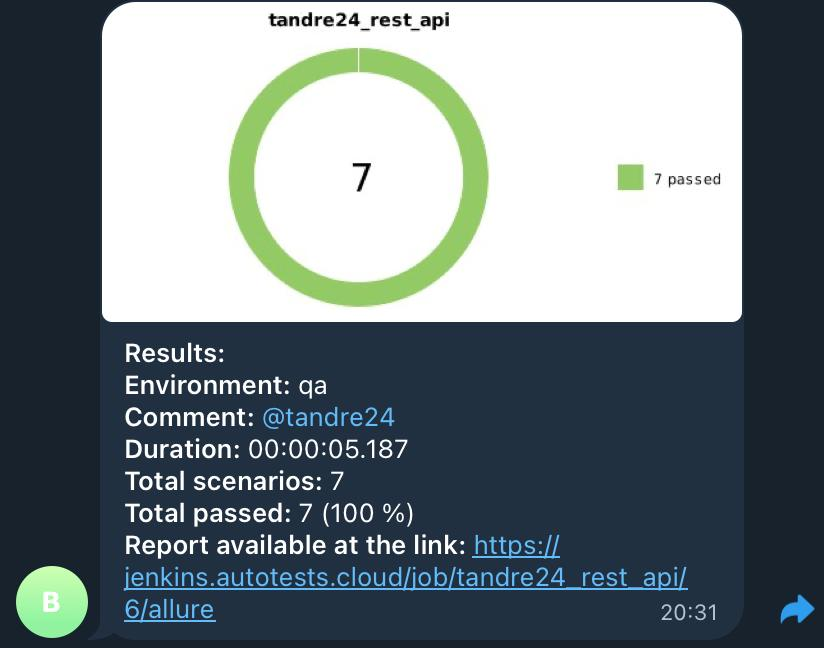

# Test Automation Project for [ReqRes](https://app.reqres.in/) website

> It's a training/demo API site that provides ‘fake’ endpoints so you can practice conveniently.

## **Contents:**
____

* <a href="#tools">Technologies and tools</a>

* <a href="#cases">Examples of automated test cases</a>

* <a href="#jenkins">Build in Jenkins</a>

* <a href="#console">Run from terminal</a>

* <a href="#allure">Allure report</a>

* <a href="#telegram">Telegram notifications via bot</a>
____
<a id="tools"></a>
## <a name="Technologies and tools">**Technologies and tools:**</a>

<p align="center">  
<a href="https://www.jetbrains.com/idea/"></a>  
<a href="https://www.java.com/"></a>  
<a href="https://github.com/"></a>  
<a href="https://junit.org/junit5/"></a>  
<a href="https://gradle.org/"></a>  
<a href="ht[images](images)tps://github.com/allure-framework/allure2"></a> 
<a href="https://www.jenkins.io/"></a>
</p>

____
<a id="cases"></a>
## <a name="Examples of automated test cases">**Examples of automated test cases:**</a>
____
- ✓ *Verify that total value after get request equals expectedTotalResult*
- ✓ *New user is added*
- ✓ *Unsuccessful login returns error*
- ✓ *Successful login returns token*
- ✓ *Verification if method PUT changes name and job for user with specified id*
- ✓ *Verification if method PATCH changes job for specified user*
- ✓ *Verification if method DELETE deletes user*

____
<a id="jenkins"></a>
## </a><a name="Build"></a>Build in [Jenkins](https://jenkins.autotests.cloud/job/tandre24_rest_api/)</a>
____
<p align="center">  
<a href="https://jenkins.autotests.cloud/job/tandre24_rest_api/"></a>  
</p>

<a id="console"></a>
## Commands for running from terminal
___
***Local run:***
```bash  
gradle clean test -DaccessKey=<API KEY>
```

***Remote run via Jenkins:***
```bash  
clean test
-DaccessKey=${API KEY}

```
___
<a id="allure"></a>
## </a> <a name="Allure"></a>Allure [report](https://jenkins.autotests.cloud/job/tandre24_rest_api/6/allure/)</a>
___

### *Main report page*

<p align="center">  </p>

### *Test cases*

<p align="center">  </p>

### *Charts*

<p align="center">   </p>

____
<a id="telegram"></a>
## </a> Telegram notifications via bot
____
<p align="center">  
  
</p>

